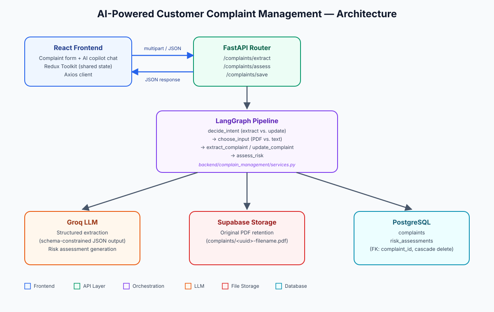

# AI-Powered Customer Complaint Management System

An AI-assisted intake and triage system for pharmaceutical customer complaints. Users submit a complaint as pasted text or a PDF upload; a LangGraph-orchestrated LLM pipeline extracts structured fields, classifies severity/priority, and generates an initial risk assessment — all surfaced live in a React form and AI copilot chat panel.

---

## Overview

Manually logging pharma complaints into a QMS is slow and error-prone: someone has to read a letter or email, decide the product, batch number, severity, and priority, and write a summary — all before an investigation can even start. This system automates the first pass: drop in a document or paste text, and the system extracts the structured record, flags likely severity/priority, drafts a risk summary, and checks for duplicates before it ever reaches the database — with a human reviewing and correcting the result before it's saved.

---

## Features

- **Text or PDF intake** — paste raw complaint text or upload a PDF letter
- **LLM-based structured extraction** — customer, product, batch number, dates, complaint type, severity, priority, and more, pulled into a typed schema
- **Conversational corrections** — tell the AI assistant what to fix ("correct customer name to XYZ Pharma") and only that field updates, everything else stays intact
- **AI risk assessment** — auto-generated complaint summary, suggested severity, suggested next action, and an initial risk narrative
- **Duplicate detection** — flags likely-duplicate complaints by customer/product/batch and normalized description similarity before saving
- **Source document retention** — uploaded PDFs are stored (Supabase Storage) and linked to the complaint record
- **Field-level provenance** — form fields populated by the AI are visually distinguished from manually entered ones, and lose that flag once a human edits them

---

## Architecture



**Backend pipeline (LangGraph):** a request enters `decide_intent` (new extraction vs. correcting an existing draft), branches into PDF text extraction or raw text handling, runs structured LLM extraction against a Pydantic schema, then always flows into an `assess_risk` node before returning to the client. See `backend/complain_management/services.py`.

---

## Tech Stack

**Backend**
- FastAPI (async)
- SQLModel + SQLAlchemy (async) over PostgreSQL
- LangGraph + LangChain for the extraction/orchestration pipeline
- Groq (LLM inference)
- Supabase Storage (uploaded PDF retention)
- pypdf (PDF text extraction)

**Frontend**
- React + Vite
- Redux Toolkit (shared complaint/risk-assessment state)
- Axios
- Tailwind CSS
- lucide-react (icons)

---

## Project Structure

```
backend/
  complain_management/
    models.py     # SQLModel tables: Complaint, RiskAssessment
    schemas.py    # Pydantic request/response schemas
    router.py     # FastAPI endpoints
    services.py   # LangGraph pipeline, LLM calls, DB operations
  config.py
  database.py
  main.py

frontend/
  src/
    api/
      axios.js            # shared Axios client + error interceptor
      complaintApi.js      # typed API calls (extract / save / assess)
    redux/
      complaintSlice.js    # complaint + risk_assessment state
      store.js
    App.jsx                # main UI: intake form + AI copilot chat
    main.jsx
```

---

## Setup

### Prerequisites
- Python 3.12+
- Node.js 18+
- A PostgreSQL database
- A Groq API key
- A Supabase project (Storage bucket for PDF originals)

### Backend

```bash
cd backend
python -m venv venv
source venv/bin/activate        # Windows: venv\Scripts\activate
pip install -r requirements.txt
```

Create a `.env` file in `backend/` with the values your `config.py` expects, at minimum:

```
DATABASE_URL=postgresql+asyncpg://<user>:<password>@<host>:<port>/<db>
GROQ_API_KEY=<your-groq-api-key>
GROQ_MODEL=<groq-model-name>
SUPABASE_URL=<your-supabase-project-url>
SUPABASE_SERVICE_ROLE_KEY=<your-supabase-service-role-key>
SUPABASE_BUCKET=<your-storage-bucket-name>
```

Run the API:

```bash
uvicorn main:app --reload --port 8000
```

### Frontend

```bash
cd frontend
npm install
```

By default the frontend calls `/api/v1` (see `src/api/axios.js`); set `VITE_API_BASE_URL` in a `.env` file if your backend isn't proxied at that path.

```bash
npm run dev
```

---

## API Endpoints

| Method | Endpoint              | Purpose                                                                 |
|--------|------------------------|--------------------------------------------------------------------------|
| POST   | `/complaints/extract`  | Extract (or update) a structured complaint draft from text or a PDF     |
| POST   | `/complaints/assess`   | Generate a risk assessment for a given complaint draft                  |
| POST   | `/complaints/save`     | Persist a reviewed complaint (and its risk assessment, if present)      |

`POST /complaints/extract` accepts multipart form data: `raw_text` **or** `file` (PDF), plus an optional `current_complaint` (JSON string) to enable in-place corrections instead of a fresh extraction.

---

## Data Model

**`complaints`** — customer/product/batch details, complaint type, dates, description, initial severity, priority.

**`risk_assessments`** — `complaint_id` (FK, cascade delete), AI-generated summary, suggested severity, suggested next action, initial risk narrative. One risk assessment per complaint.

---

## Notes / Known Limitations

- PDF extraction requires a text layer — scanned/image-only PDFs are not OCR'd
- Risk assessment is best-effort: if the LLM call fails, complaint extraction still succeeds and returns without a risk assessment
- AI-suggested fields (severity, priority, extracted values) are meant for human review before saving, not automatic submission